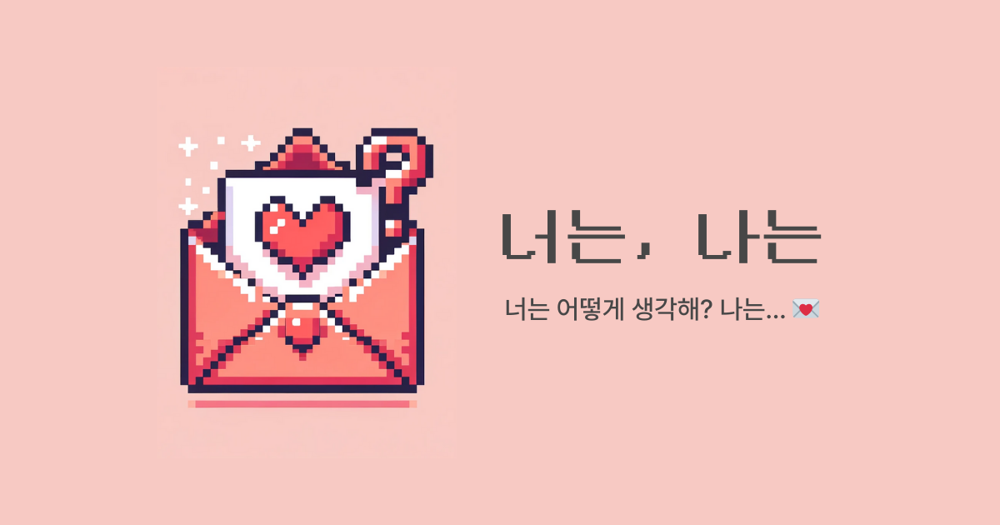
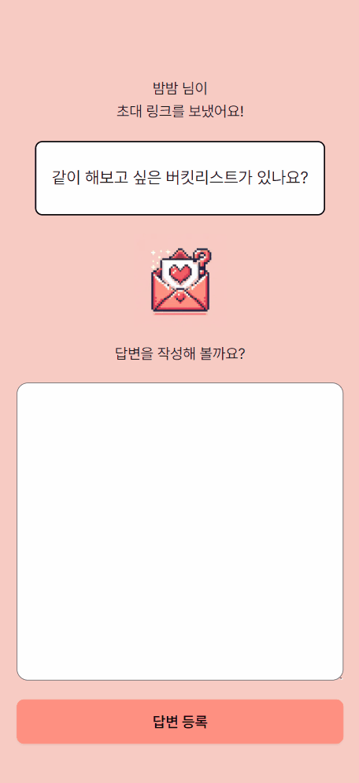

<div align='center'>

# 💘 너는, 나는 💘



<b> _너는 어떻게 생각해? 나는…_ 💌 <br/>
질문을 공유하고 답변하며 서로에 대해 더 알아갈 수 있는 서비스</b> <br />

👉 배포 주소: https://youare-iam.vercel.app/
<br/>
🧵 이용 가이드라인: https://bit.ly/youare-iam
<br/>
💙 트위터: https://twitter.com/youare_iam_
<br/>
📮 피드백&문의: https://youare-iam.channel.io

<br/>

</div>

<div >

<br/>

# 🤝 팀 소개

**멋**진 **개**발자, 멋개! 저희 팀 이름은 ‘멋개’ 입니다. 선후배 개발자 분들에게 선한 영향력을 줄 수 있는 멋진 개발자가 되자는 의미로 ‘멋개’ 라고 지었습니다.

<table align="center" style="width: 100%;">
    <tr align="center">
        <td style="width: 50%;">
            <b>🧡김미정(쪙이)🧡</b>
            <br/>
            <b style='font-size:12px'>백엔드</b>
            <br/>
            
            <br/>
            <a href="https://github.com/meezzui">https://github.com/meezzui</a>    
        </td>
        <td style="width: 50%;">
            <b>💛전다빈(감티)💛</b>
            <br/>
            <b style='font-size:12px'>백엔드</b>
            <br/>
            
            <br/>
            <a href="https://github.com/samjan29">https://github.com/samjan29</a>
        </td>
        <td style="width: 50%;">
            <b>🤎이슬(밤밤)🤎</b>
            <br/>
            <b style='font-size:12px'>프론트</b>
            <br/>
            
            <br/>
            <a href="https://github.com/seul-dev">https://github.com/seul-dev</a>
        </td>
        <td style="width: 50%;">
            <b>💙이지선(비얌)💙</b>
            <br/>
            <b style='font-size:12px'>프론트</b>
            <br/>
            
            <br/>
            <a href="https://github.com/biyamn">https://github.com/biyamn</a>
        </td>
    </tr>
    <tr align="center">
        <td style="width: 50%;">
            한 번 시작한 일은 절대 포기하지 않아요😊
            <br/>
            <b>Springboot</b>, <b>Mybatis</b>, <b>Mysql</b>, <b>JPA</b> 경험이 있으며 현재 JPA를 공부 중 입니다!!
            <br/>
            <br/>
            <b>[담당기능]</b>
            <br/>
            - sns 로그인
            <br/>
            - 사용자 초대에 관련 API
        </td>
        <td style="width: 50%;">
            개발을 좋아하고 문제 해결이 재밌어요!
            <br />
            <br/>
            <b>[담당기능]</b>
            <br/>
            - Refresh token
            <br/>
            - 로그아웃
            <br/>
            - 질문, 답변 관련 API
            <br/>
            - 배포
        </td>
        <td style="width: 50%;">
            컴포넌트화, 모듈화, 클래스화를 좋아합니다.
            <br/>
            <br/>
            <b>[담당기능]</b>
            <br/>
            - 온보딩 ui 구현
            <br/>
            - 카카오 소셜 로그인 
            <br/>
            - 레이아웃 구현
        </td>
        <td style="width: 50%; word-break: keep-all;">
            새롭게 배우고 코드에 적용해보는 것을 좋아해요.
            <br/>
            <br/>
            <b>[담당기능]</b>
            <br/>
            - 무한 스크롤
            <br/>
            - 페이지 라우팅
            <br/>
            - 공통 컴포넌트 구현
            <br/>
            - 배포 자동화
        </td>
    </tr>
</table>

<br/>

# 🛠️ 프론트엔드 기술 스택

<table>
<tr>
 <td align="center">언어</td>
 <td>
  
 </td>
</tr>
<tr>
 <td align="center">프레임워크</td>
 <td>
  
 </td>
</tr>
<tr>
 <td align="center">라이브러리</td>
 <td>
  &nbsp
  &nbsp
  &nbsp
  &nbsp
  &nbsp
 </td>
</tr>
<tr>
 <td align="center">CSS 프레임워크</td>
 <td>
  &nbsp
  &nbsp
 </td>
</tr>
<tr>
 <td align="center">패키지</td>
 <td>
    
  </td>
</tr>
<tr>
 <td align="center">포맷터 및 린터</td>
 <td>
  &nbsp 
  &nbsp 
  &nbsp 
 </td>
</tr>

<tr>
 <td align="center">협업</td>
 <td>
    &nbsp
    &nbsp 
    &nbsp
    &nbsp  
 </td>
</tr>
</table>

<br/>

# 🙋 프로젝트 소개

### 기획 의도

서로 좋아하거나 사랑하는 사이라도 **직접적으로 말하기 어려웠던 점**은 없나요?

혹은 **상대에 대해 더 알아가고 싶었던 적**이 있었나요?

가장 가까운 사이라도 이야기하지 못했던, 혹은 궁금했던 점들이 있었나요?

어떻게 하면 재밌고 더 편하게 질문할 수 있을지 고민하다가 `너는, 나는` 을 만들게 되었습니다.

### 프로젝트 설명

_너는 어떻게 생각해? 나는…_

질문을 공유해서 공유된 질문에 대한 답변으로 서로에 대해 더 알아갈 수 있는 서비스입니다.

주요 사용자 타겟은 연인입니다.

- 사용자가 `너는, 나는` 서비스에 접속하여 로그인 후 나누고 싶은 질문을 선택 후 초대 링크를 통해 해당 질문을 연인에게 보냅니다.
- 초대 링크를 받은 상대가 해당 질문에 답변을 작성하고 로그인을 하면 초대가 수락되며, 질문에 대한 서로의 답변을 확인할 수 있습니다.
- 질문은 하루에 한 번만 선택할 수 있고, 질문에 대한 답변은 양쪽 모두가 답변을 작성해야만 확인이 가능합니다.
- 질문 리스트는 DB에 저장해 둔 프리셋 질문들을 사용합니다.

### 나중에 추가하고 싶은 기능

작업을 하면서 이런 기능들이 있으면 사용자들이 더 편하게 서비스를 이용할 수 있겠다고 생각되었던 것들을 정리해 보았습니다.

1. 질문 현황 페이지

2. 답변 수정

3. 커스텀 질문 등록

4. 알림 기능

<br/>

# 프로젝트 주요 기능 소개

<table align="center">
  <tr align="center">
    <td>로그인</td>
    <td>동작</td>
  </tr>
  <tr>
    <td align="center">
      <b>메인 페이지에서 ‘카카오 로그인’ 버튼을 누르면 카카오 소셜 로그인 페이지로 </b>
      <br/>
      <b>이동하여 카카오 로그인을 할 수 있습니다.</b>
    </td>
    <td align="center">
      
    </td>
  </tr>
  <tr align="center">
    <td>사용자 초대</td>
    <td>동작</td>
  </tr>
  <tr>
    <td align="center">
     <b>상대방에게 묻고 싶은 질문을 선택하고, 카카오톡 친구에게 공유하여 초대할 수 있습니다.</b>
    </td>
    <td align="center">   
      
    </td>
    </td>
  </tr>
  <tr align="center">
    <td>초대 수락</td>
    <td>동작</td>
  </tr>
  <tr>
    <td align="center">
     <b>- 초대받은 사용자는 카카오톡으로 공유된 링크에 접속하여 질문에 대한 답변을 작성할 수 있습니다.</b>
      <br/>
      <br/>
     <b>- 초대받은 사용자가 답변을 등록하려면 로그인을 해야 하며, 답변 작성 후 등록시 카카오 로그인 페이지로 리다이렉트됩니다.</b>
      <br/>
      <br/>
     <b>- 로그인에 성공하면 로그인 전에 작성한 답변을 등록할 수 있으며, 커플이 맺어짐과 동시에 서로의 답변을 확인할 수 있습니다.</b>
    </td>
    <td align="center">   
      
    </td>
    </td>
  </tr>
  <tr align="center">
    <td>질문 선택</td>
    <td>동작</td>
  </tr>
  <tr align="center">
    <td>
     <b>커플이 답변할 질문을 질문 선택 페이지에서 매일 한개씩 선택할 수 있습니다.</b>
      <br/>
      <br/>
     <b>질문을 선택하면 대화 상세 페이지로 이동하며, 선택한 질문이 하단에 추가된 것을</b>
      <br/>
      <b>확인할 수 있습니다.</b>
    </td>
    <td align="center">
      
    </td>
  </tr>
  <tr align="center">
    <td>답변 등록</td>
    <td>동작</td>
  </tr>
  <tr align="center">
    <td>
     <b>대화 상세 페이지에서 선택한 질문을 클릭하여 답변을 작성할 수 있습니다.</b>
      <br/>
      <br/>
     <b>두 사람 모두 작성한 후 답변을 확인할 수 있으며, 둘 중 한 명만 답변했을 경우</b>
      <br/>
      <b>안내 메시지가 오버레이되며 답변을 확인할 수 없습니다.</b>
    </td>
    <td align="center">
      
    </td>
  </tr>
  <tr align="center">
    <td>대화 상세 페이지</td>
    <td>동작</td>
  </tr>
  <tr align="center">
    <td>
     <b>선택한 질문과 이에 대한 답변은 채팅 형식으로 대화 상세 페이지에 누적됩니다.</b>
      <br/>
      <br/>
     <b>로그인한 사용자의 답변은 오른편에, 상대방의 답변은 왼편에 배치됩니다.</b>
      <br/>
      <br/>
      <b>최신 질문일수록 하단에서 확인할 수 있으며,</b>
      <br/>
      <b>오래된 질문은 스크롤을 위로 올려 확인할 수 있습니다.</b>
    </td>
    <td align="center">
      
    </td>
  </tr>
</table>

<br/>

# 🚀 프로젝트 실행 방법

### 사전 요구사항

- Node.js (v20.10.0)
- npm (버전 10.2.3)

Node.js와 npm 버전을 확인하는 방법은 다음과 같습니다.

```shell
$ node -v
v20.10.0
```

```shell
$ npm -v
10.2.3
```

### 설치 및 실행

1. 프로젝트를 로컬 환경으로 복제합니다.

```shell
git clone https://github.com/coding-union-kr/youare-iam-fe.git
```

2. 프로젝트 루트 디렉토리에서 아래 명령어를 입력하여 의존성 패키지를 설치합니다.

```shell
$ npm install
```

3. 프로젝트 루트 디렉토리에 `.env` 파일을 생성하여 아래와 같이 변수를 설정합니다.

```
NEXT_PUBLIC_KAKAO_CLIENT_ID=
NEXT_PUBLIC_BACKEND_URL=
NEXT_PUBLIC_KAKAO_REDIRECT_URI=
NEXT_PUBLIC_KAKAO_JAVASCRIPT_KEY=
```

4. 프로젝트 루트 디렉토리에서 아래 명령어를 입력하여 프로젝트를 실행합니다.

```shell
$ npm run dev
```

<br />

# 😊프로젝트 진행을 위한 노력😊

저희는 3주간의 기획 기간과 3주간의 개발 기간을 합쳐 총 6주차에 MVP를 출시하겠다는 목표를 세웠습니다.
<br/>
그러나 6주차에 프론트엔드는 MVP 기능 중 초대하기와 무한스크롤 기능, 백엔드는 인증과 배포 구현이 완료되지 않은 상태였습니다.
<br/>
또한 기존의 MVP 목표에 리프레시 토큰 구현이 추가되었고 테스트를 하며 서비스를 더 보완하는 시간을 가졌습니다. 5주 간의 추가 개발 기간을 가진 후 11주차에 릴리즈를 하게 되었습니다.

1. 그라운드 룰📃

- 팀 일정 관리 도구🛠
  - 프로젝트 기간 동안 일정 관리를 위해서 노션(Notion) 캘린더, 슬랙(Slack)을 이용했습니다.
  - 회의 일정, 작업 진행 상황 및 마일스톤을 공유해서 팀원 간 진행 상황을 투명하게 공유할 수 있도록 했습니다.
- 주간 스크럼 및 코어 타임⏰
  - 매주 4회, 오후 1시부터 6시까지 스크럼 회의와 코어타임을 진행했습니다.
  - 스크럼 회의에서는 각 팀원이 현재 진행 중인 작업과 그 진행 상황, 앞으로 해결해야할 계획을 공유했습니다.
  - 코어타임에는 프론트엔드와 백엔드 팀이 각각 나뉘어 작업 목표를 설정하고, 이를 달성하기 위해서 집중적으로 협업했습니다.
  - 또한, 코어타임 중에는 화면 공유를 통해 서로의 작업 과정을 실시간으로 확인하고, 필요한 경우 페어 프로그래밍을 진행했습니다.
- 정기 회고 회의📝
  - 매주 일요일에 주간 회고 회의를 진행했습니다. 이 회의에서는 팀원들의 회고를 공유하면서 한 주간의 팀 운영에 대한 피드백을 진행했습니다.
  - 회의 결과를 차주의 목표에 반영했습니다.
- 마일스톤 일정 조정✅ - 프로젝트 진행 중 일부 기능 개발에 예상보다 더 많은 시간이 소요된 경우에는, 회의를 통해서 마일스톤 일정을 조정하고, 추가적인 리소스를 해당 작업에 할당해서 프로젝트를 완료할 수 있었습니다.
  <br/>

<br/>

2. 기능 우선순위💈

- 첫 기획 완료 후 필수 기능과 추가 기능이 무엇인지 정의하고 나눠서 MVP 목표를 설정했습니다.
- MVP 목표 중에서도 중요도로 정리를 해서 소셜 로그인, 질문 선택 후 등록, 답변 등록, 질문과 답변 상세 조회 를 핵심 기능으로 설정했습니다.
  - 핵심 기능으로 설정한 이유🧐
    - 소셜 로그인 : 커플을 맺는 플로우가 확립되지 않았기 때문에 핵심 기능 바로 다음 우선순위인 초대 관련 기능을 구현하기 위해선 소셜 로그인이 구현되어야 했기 때문입니다.
    - 질문 선택 후 등록, 답변 등록, 질문과 답변 상세 조회 : 이 프로젝트의 핵심이 대화의 포문을 열 수 있는 질문을 선택해서 서로 답변을 하고 확인하는 것이기 때문에 해당 기능들을 핵심 기능으로 설정했습니다.
- MVP 목표 중에서는 핵심 기능을 1순위로 두고 먼저 작업하였으며 핵심 기능 구현 후 작업이 완료된 기능을 보완하거나 그 기능과 연관된 기능을 다음 우선순위로 결정하였습니다.
- 이후에는 프론트엔드의 흐름에 따라 필요한 기능을 먼저 작업하거나 팀 회의를 통해서 서비스 흐름의 방향이 수정되거나 추가 됐을 때 필요한 기능을 0순위로 잡아서 작업했습니다.

<br/>

3. 프론트 엔드 팀원 업무 분배🙋‍♀️

프론트 엔드 팀은 다음과 같이 역할과 책임을 분배하였습니다.

- 밤밤(이슬) : 메인 페이지, 프로젝트 레이아웃 컴포넌트 구현, 로그인 기능 구현, 온보딩 페이지, 답변등록 페이지
- 비얌(이지선): 대화 상세 페이지, 질문 목록 페이지, 초대수락 페이지, 사용자 상태에 따른 라우팅 구현

담당 역할 분배는 각 팀원의 기술적인 관심사를 고려해서 이루어졌습니다. 개인적으로 도전해보고 싶었던 것, 고민을 많이 해봐서 구현을 완성하고 싶었던 것을 기준으로 분배되었습니다.

팀원들은 코어타임을 주 4회 진행하면서 일상적인 소통을 진행하고 각자의 작업에 대한 피드백을 공유했고, 기술적인 어려움을 함께 해결하기 위해서 노력했습니다.

<br/>
