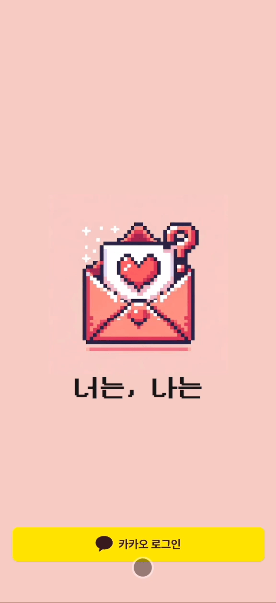
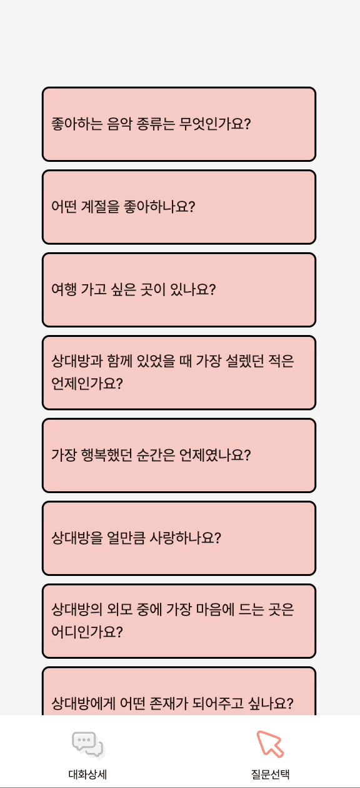
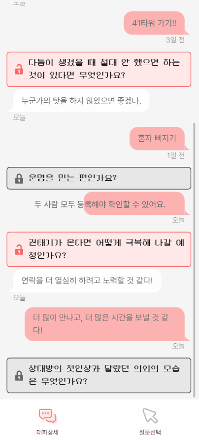

## 💌 프로젝트 소개

### 프로젝트 명

**너는, 나는**

### 기획 의도

서로 좋아하거나 사랑하는 사이라도 **직접적으로 말하기 어려웠던 점**은 없나요?

혹은 **상대에 대해 더 알아가고 싶었던 적**이 있었나요?

가장 가까운 사이라도 이야기하지 못했던, 혹은 궁금했던 점들이 있었나요?

어떻게 하면 재밌고 더 편하게 질문할 수 있을지 고민하다가 `너는, 나는` 을 만들게 되었습니다.

### 프로젝트 설명

_너는 어떻게 생각해? 나는…_

질문을 공유해서 공유된 질문에 대한 답변으로 서로에 대해 더 알아갈 수 있는 서비스입니다.

주요 사용자 타겟은 연인입니다.

- 사용자가 `너는, 나는` 서비스에 접속하여 로그인 후 나누고 싶은 질문을 선택 후 초대 링크를 통해 해당 질문을 연인에게 보냅니다.
- 초대 링크를 받은 상대가 해당 질문에 답변을 작성하고 로그인을 하면 초대가 수락되며, 질문에 대한 서로의 답변을 확인할 수 있습니다.
- 질문은 하루에 한 번만 선택할 수 있고, 질문에 대한 답변은 양쪽 모두가 답변을 작성해야만 확인이 가능합니다.
- 질문 리스트는 DB에 저장해 둔 프리셋 질문들을 사용합니다.

### 나중에 추가하고 싶은 기능

작업을 하면서 이런 기능들이 있으면 사용자들이 더 편하게 서비스를 이용할 수 있겠다고 생각되었던 것들을 정리해 보았습니다.

1. 질문 현황 페이지

2. 답변 수정

3. 커스텀 질문 등록

4. 알림 기능

# 프로젝트 주요 기능 소개

1. 로그인

   - 메인 페이지에서 ‘카카오 로그인’ 버튼을 누르면 카카오 소셜 로그인 페이지로 이동하여 카카오 로그인을 할 수 있습니다.

     

2. 사용자 초대 및 초대 수락

   - 초대하기
     - 상대방에게 묻고 싶은 질문을 선택하고, 카카오톡 친구에게 공유하여 초대할 수 있습니다.
   - 초대 수락하기
     - 초대받은 사용자는 카카오톡으로 공유된 링크에 접속하여 질문에 대한 답변을 작성할 수 있습니다.
     - 초대받은 사용자가 답변을 등록하려면 로그인을 해야 하며, 답변 작성 후 등록시 카카오 로그인 페이지로 리다이렉트됩니다.
     - 로그인에 성공하면 로그인 전에 작성한 답변을 등록할 수 있으며, 커플이 맺어짐과 동시에 서로의 답변을 확인할 수 있습니다.
       `이미지 추후 업로드`

3. 질문 선택

   - 커플이 답변할 질문을 질문 선택 페이지에서 매일 한개씩 선택할 수 있습니다.
   - 질문을 선택하면 대화 상세 페이지로 이동하며, 선택한 질문이 하단에 추가된 것을 확인할 수 있습니다.

     

4. 질문 답변 등록

   - 대화 상세 페이지에서 선택한 질문을 클릭하여 답변을 작성할 수 있습니다.
   - 두 사람 모두 작성한 후 답변을 확인할 수 있으며, 둘 중 한 명만 답변했을 경우 안내 메시지가 오버레이되며 답변을 확인할 수 없습니다.

     

5. 대화 상세 페이지

   - 선택한 질문과 이에 대한 답변은 채팅 형식으로 대화 상세 페이지에 누적됩니다.
   - 로그인한 사용자의 답변은 오른편에, 상대방의 답변은 왼편에 배치됩니다.
   - 최신 질문일수록 하단에서 확인할 수 있으며, 오래된 질문은 스크롤을 위로 올려 확인할 수 있습니다.

     

# 🤝 팀 소개

### ❣️팀 소개

**멋**진 **개**발자, 멋개!

저희 팀 이름은 ‘멋개’ 입니다.

선후배 개발자 분들에게 선한 영향력을 줄 수 있는 멋진 개발자가 되자는 의미로 ‘멋개’ 라고 지었습니다.

### ❣️팀원 소개

<table align="center" style="width: 100%;">
    <tr align="center">
        <td style="width: 50%;">
            <b>🧡김미정(쪙이)🧡</b>
            <br/>
            <b>백엔드</b>
            <br/>
            
            <a href="https://github.com/meezzui">https://github.com/meezzui</a>    
        </td>
        <td style="width: 50%;">
            <b>💛전다빈(감티)💛</b>
            <br/>
            <b>백엔드</b>
            <br/>
            
            <a href="https://github.com/samjan29">https://github.com/samjan29</a>
        </td>
    </tr>
    <tr align="center">
        <td style="width: 50%;">
            한 번 시작한 일은 절대 포기하지 않아요😊
            <br/>
            <b>Springboot</b>, <b>Mybatis</b>, <b>Mysql</b>, <b>JPA</b> 경험이 있으며 현재 JPA를 공부 중 입니다!!
            <br/>
            <b>[담당기능]</b>
            <br/>
            - sns 로그인
            <br/>
            - 사용자 초대에 관련 API
        </td>
        <td style="width: 50%;">
            개발을 좋아하고 문제 해결이 재밌어요!
            <br />
            <b>[담당기능]</b>
            <br/>
            - Refresh token
            <br/>
            - 로그아웃
            <br/>
            - 질문, 답변 관련 API
            <br/>
            - 배포
        </td>
    </tr>
    <tr align="center">
    </tr>
    <tr align="center">
        <td style="width: 50%;">
            <b>🤎이슬(밤밤)🤎</b>
            <br/>
            <b>프론트</b>
            <br/>
            
            <a href="https://github.com/seul-dev">https://github.com/seul-dev</a>
        </td>
        <td style="width: 50%;">
            <b>💙이지선(비얌)💙</b>
            <br/>
            <b>프론트</b>
            <br/>
            
            <a href="https://github.com/biyamn">https://github.com/biyamn</a>
        </td>
    </tr>
    <tr align="center">
        <td style="width: 50%;">
            컴포넌트화, 모듈화, 클래스화를 좋아합니다.
            <br/>
            <b>[담당기능]</b>
            <br/>
            - 온보딩 ui 구현
            <br/>
            - 카카오 소셜 로그인 
            <br/>
            - 레이아웃 구현
        </td>
        <td style="width: 50%;">
            새롭게 배우고 코드에 적용해보는 것을 좋아해요.
            <br/>
            <b>[담당기능]</b>
            <br/>
            - 무한 스크롤
            <br/>
            - 페이지 라우팅
            <br/>
            - 공통 컴포넌트 구현
            <br/>
            - 배포 자동화
        </td>
    </tr>
</table>

# 🚀 프로젝트 실행 방법

### 사전 요구사항

- Node.js (v20.10.0)
- npm (버전 10.2.3)

Node.js와 npm 버전을 확인하는 방법은 다음과 같습니다.

```shell
$ node -v
v20.10.0
```

```shell
$ npm -v
10.2.3
```

### 설치 및 실행

1. 프로젝트를 로컬 환경으로 복제합니다.

```shell
git clone https://github.com/coding-union-kr/youare-iam-fe.git
```

2. 프로젝트 루트 디렉토리에서 아래 명령어를 입력하여 의존성 패키지를 설치합니다.

```shell
$ npm install
```

3. 프로젝트 루트 디렉토리에 `.env` 파일을 생성하여 아래와 같이 변수를 설정합니다.

```
NEXT_PUBLIC_KAKAO_CLIENT_ID=
NEXT_PUBLIC_BACKEND_URL=
NEXT_PUBLIC_KAKAO_REDIRECT_URI=
NEXT_PUBLIC_KAKAO_JAVASCRIPT_KEY=
```

4. 프로젝트 루트 디렉토리에서 아래 명령어를 입력하여 프로젝트를 실행합니다.

```shell
$ npm run dev
```

# 🛠️ 프론트엔드 기술 스택

<table>
<tr>
 <td align="center">언어</td>
 <td>
  
 </td>
</tr>
<tr>
 <td align="center">프레임워크</td>
 <td>
  
 </td>
</tr>
<tr>
 <td align="center">라이브러리</td>
 <td>
  &nbsp
  &nbsp
  &nbsp
  &nbsp
  &nbsp
 </td>
</tr>
<tr>
 <td align="center">CSS 프레임워크</td>
 <td>
  &nbsp
  &nbsp
 </td>
</tr>
<tr>
 <td align="center">패키지</td>
 <td>
    
  </td>
</tr>
<tr>
 <td align="center">포맷터 및 린터</td>
 <td>
  &nbsp 
  &nbsp 
  &nbsp 
 </td>
</tr>

<tr>
 <td align="center">협업</td>
 <td>
    &nbsp
    &nbsp 
    &nbsp
    &nbsp  
 </td>
</tr>
</table>
